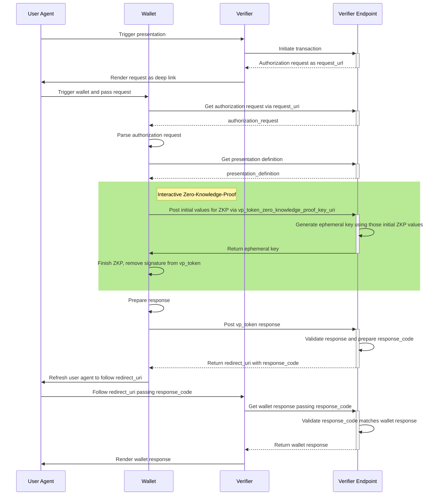

# OpenID4VP with Zero-Knowledge-Proof

This is a proof of concept for adding plausible deniability to [OpenID4VP](https://openid.github.io/OpenID4VP/openid-4-verifiable-presentations-wg-draft.html) using a Zero-Knowledge proof during presentation.

This library provides a simple interface to the OpenID4VP feature addition in Swift. There is also a [Kotlin library](https://github.com/TICESoftware/ZKP) available.

# Overview

## Context

This project has been developed as part of the [SPRIND EUDI Wallet Prototypes Challenge](https://www.sprind.org/de/challenges/eudi-wallet-prototypes).

### Problem statement

When disclosing claims, there are three parties involved. The issuer, the prover and the verifier. The issuer issues the information (PID) and signs them, so that the prover can prove the authenticity of the claims to a verifier. The issuer takes the claims (of which some are disclosed) and can verify that they were indeed issued by the trusted issuer for the prover.

In the normal variant, the prover sends the signature to the verifier. While the signature proves the authenticity, it gives the verifier the ability to prove to others that the claims about the prover are authentic. In other words: The prover can not deny the made claims and thus has no plausible deniability.

### Solution outline

We tackle this problem by using zero knowledge proofs (ZKPs) about the possession of the digital signature without revealing it. When proving the authenticity about the claims to the verifier, the prover instead sends a ZKP that proves that they have a signature issued by the issuer for those claims. This ZKP is interactive between the provider and the verifier and thus only convinces the verifier about the authenticity. The verifier is not able to prove the authenticity to others later.

We make use of a known procedure for ZKP on discrete log problems (like ECDSA signatures) by using Diffie-Hellmann key exchange as a challenge algorithm. By challenging the prover to calculate a shared secret based on part of the signature (unknown to the verifier), the verifier can verify the possession of the signature without revealing it. This protocol is based on the [three-pass identification scheme used on ECDSA signatures](https://www.rfc-editor.org/rfc/rfc8235).

## Mathematical background

The issuer $I$ with a ECDSA signing keypair $(I_{pubkey},I_{privkey})$ signs the issued claims (contents $m$ of the SD-JWT or mdoc) using a cryptographic hash function $H$ which leads to a ECDSA signature $(r,s)$ and sends $(I_{pubkey}, m, r, s)$ to the prover $P$ (this is in line with the original proposal C). Additionally, the issuer sends the information needed to disclose the claims, which we will omit as they continue to work as usual.

$P$ wants to prove to some relaying party (verifier) that the claim payload $m$ is authentic, meaning it was signed by the issuer $I$ and was not tempered with by anyone else. $P$ does not want the verifier to learn the signature $(r,s)$ of $m$. Instead, the prover will send only half of the signature $(r)$ and will prove that it knows $s$ for which the signature verifies using $I_{pubkey}$.

Let’s bring to mind how $(r,s)$ is computed from the message $m$ where $z$ are the $L_n$ leftmost bits of $e$, where $e=H(m)$.

$$
\begin{aligned}
k \text{ random } &\in [1, n-1] \\
(x_1,y_1) &= k \times G \\
r &= x_1 \\
s &= k^{-1} (z + rI_{privkey})
\end{aligned}
$$

The prover sends $m, I_{pubkey}, H$ and $r$ to the verifier.

The verifier generates an ephemeral key pair $(E_{privkey}, E_{pubkey})$ where $E_{pubkey} = E_{privkey} \times G_{new}$. The new generator $G_{new} = z \times G + r \times I_{pubkey}$ is dependent on the issuer’s public key $I_{pubkey}$, the message $m$ and the $r$ of the signature. The verifier sends $E_{pubkey}$ to the prover as a challenge to prove knowledge of $s$.

The prover calculates $R = s^{-1} \times G_{new}$. Additionally, the prover does a Diffie-Hellman key exchange with the private key $s^{-1}$ and $E_{pubkey}$ and sends both $R$ and the shared secret $S_{shared}$ to the verifier (making the proof interactive).

$$
\begin{aligned}
S_{shared} &= s^{-1} \times E_{pubkey} \\
&= s^{-1} \times E_{privkey} \times G_{new}
\end{aligned}
$$

The verifier can now verify that the prover knows $a$ (or that they can find the discrete logarithm, which is assumed hard) by doing a Diffie-Hellman key exchange with the counterpart $(E_{privkey}, R)$ by calculating the following:

$$
\begin{aligned}
E_{privkey} \times R &= E_{privkey} \times (s^{-1} \times G_{new}) \\
&= s^{-1} \times E_{privkey} \times G_{new} \\
&= S_{shared}
\end{aligned}
$$

By comparing the equality of the received shared secret $S_{shared}$ and the calculated Diffie-Hellman-Key-Agreement, the verifier can verify that the prover indeed knows $s$.

## Feature addition to OpenID4VP

We propose the following mechanism in order to add plausible deniablity to OpenID4VP with as few changes as possible. The apporach outlined here basically has three aspects:

1. Signaling between Relying Party (Verifier) and Wallet app is achived by introducing a seperate format for each already supported format (e. g. `mso_mdoc+zkp` for `mso_mdoc` and so on). That way the presentation can be done without this feature if one of the two parties doesn't support it. If the Relying Party supports ZKP it adds the format to the supported formats in the `presentation_definition`. If the wallet app then also supports ZKP it uses the `...-zkp` format for presentation.

2. The Zero-Knowledge poof requires an interactive communication step before the wallet can submit the actual authorization response. Relying Party and wallet app need to exchange some challenge/response-like values. This is done by the RP exposing an endpoint for exchanging those values. OpenID4VP already supports a step like this inbetween when encrypting the responses. There in order to agree on key material the verifier exposes an endpoint for doing the key agreement. So this isn't actually a significant protocol addition at all.

3. Verification is slightly modified so that the Relying Party not validates the issuer's signature directly but rather by verifying the challenge response submitted by the wallet. A successful verification of the challenge response is the equivalent of a (plain-)signature validation.


### Implementation

#### 1. Authorization Request

Additional data must be added to the  `client_metadata` in the `presentation_definition` (see [OpenID4VP section 9](https://openid.github.io/OpenID4VP/openid-4-verifiable-presentations-wg-draft.html#section-9)).

* Add claim `vp_token_zkp_key_uri` pointing to the endpoint for generating ephemeral key(s) used for interactive zero knowledge proof(s) (see section 2)
    * This mechanism is similar to the exchange of the `JWKS` key for response encryption (see [OpenID4VP section 6.3.](https://openid.github.io/OpenID4VP/openid-4-verifiable-presentations-wg-draft.html#section-6.3-11)) in the response mode "direct_post.jwt".
* Add possible zero-knowledge proof formats into `vp_formats`

    * `vc+sd-jwt+zkp` for a SD-JWT-like representation (based on `vc+sd-jwt` format identifier for SD-JWT)
    * `mso_mdoc+zkp` for a mdoc-like representation (based on `mso_mdoc` format identifier for Mdoc)
    * having a subkey `proof_type` containing possible curves and hash functions (e.g. using `secp256r1` and `sha256` leads to value `secp256r1-sha256` here)

* Specific format requirements may be specified for each `input_descriptor` element

    * this follows [section 5 from DIF Presentation Exchange 2.0.0](https://identity.foundation/presentation-exchange/spec/v2.0.0/#presentation-definition)

* Example:
  ```json
  {
    "presentation_definition": {
      "input_descriptors": [
        {
          "id": "eu.europa.ec.eudiw.pid.1",
          "format": { "vc+sd-jwt+zkp": { "proof_type": ["secp256r1-sha256"] } },
          [...]
        }
      ],
      "client_metadata": {
        "vp_token_zkp_key_uri": "https://verifier-example.dev/wallet/zkp/wDTYGoskVS9i3tijp6z0B0p/jwks.json",
        "vp_formats": {
          "vc+sd-jwt+zkp": {
            "proof_type": ["secp256r1-sha256"]
          },
          "mso_mdoc+zkp": {
            "proof_type": ["secp256r1-sha256"]
          }
        }
        [...]
      }
      [...] 
    },
    [...]
  }
  ```

#### 2. Fetch ephemeral key (additional communication step)

* since the `presentation_definition` may contain multiple `input_descriptor`s, this endpoint returns a set of public keys, one for each descriptor, identified by `id`
* Method: `POST`
* URI:  `client_metadata.vp_token_zkp_key_uri` of Authorization Request (see section 1)
* Example request (`application/json`):
  ```json
  [
    {
      "id": "eu.europa.ec.eudiw.pid.1",
      "digest": "_4KGX6aVS8B0T6Hewpr1H9h9-gjkjOyu8A6fb85GE2w=",
      "r": "C7U9q9o7dkDEhcOYXO9yfckQYoRxYs8z6POaac6EBjM=",
      "proof_type": "secp256r1-sha256"
    }
  ]
  ```
    * `digest` being derived from the (payload inside)  `vp_token` using SHA-256
    * `r` being the first half of the signature from the `vp_token`

* Example response (`application/jwk-set+json`):
  ```json
  [
    {
      "id": "eu.europa.ec.eudiw.pid.1",
      "kid": "eu.europa.ec.eudiw.pid.1",
      "kty": "EC",
      "crv": "P-256",
      "x": "jjR25_Day4VGHGGSn0uW_dzS7dVO0at8xh8gZ8z992A",
      "y": "16LSQqNZzvs5BEIqsdnkWw127L0j3ThNbiMAN0BIQQY"
    }
  ]
  ```
    * those keys are ephemeral public keys derived from the input data (`digest` and `r`)
    * the EC key generation is non-standard but also on the `secp256r1` curve
    * each key is matched to the `input_descriptor` using the `id`

#### 3. Response

* the response structure stays the same, according to [OpenID4VP section 6.1.](https://openid.github.io/OpenID4VP/openid-4-verifiable-presentations-wg-draft.html#section-6.1)
* inside the `descriptor_map` the used `format` is specified
    * possible formats:  `vc+sd-jwt+zkp`  and `mso_mdoc+zkp`  (see above at section 1)
* the tokens having a `...+zkp` format include parameters to finalize the zero-knowledge proof instead of the static signature from the issuer

### Sequence diagram

The sequence diagram is similar to the one without zero-knowledge proof. The green rectangle highlights the additional steps. (Base for the diagram is [in the Verifier Endpoint reference implementation](https://github.com/eu-digital-identity-wallet/eudi-srv-web-verifier-endpoint-23220-4-kt)).



## Usage of this library

This library offers a simple interface to the necessary operations performed on the plain credential data for the wallet (proofer) and on the authorization response for the Relying Party (verifier). `mdoc` and `SD-JWT` are supported.

1.  Issuer
    - The proofer initializes a `ZKPProofer` instance providing the issuer's public key.
      ```swift
      let generator = ZKPGenerator(issuerPublicKey: issuerPublicKey, domain: .instance(curve: .EC256r1))
      let prover = ZKPProverSDJWT(zkpGenerator: generator)
      ```
    - They then create a challenge request that is begin sent to the verifier. In this example the SD-JWT format is selected and the issued JWT is provided to the library.
      ```swift
      let request = try prover.createChallengeRequestData(jwt: someJwt)
      ```
2. Verifier
    - The verifier processes the challenge request by initializing a `ZKPVerifier` instance also by providing the issuer's public key.
        ```swift
        let verifier = ZKPVerifier(issuerPublicKey: issuerPublicKey)
        ```
    - They calculate the challange by providing the library with the challange request received from the proofer. The challenge is being submitted to the proofer and the calculated key needs to be stored temporarily by the verifier.
        ```swift
        let (challengePublicKey, challengePrivateKey) = try verifier.createChallenge(requestData: request)
        ```
3. Issuer
    - The issuer solves the challenge and replaces the signature in the original credential by the result. The modified document is then presented to the verifier using the usual OpenID4VP protocol.
      ```swift
      let answer = try prover.answerChallenge(ephemeralPublicKey: challengePublicKey, jwt: someJwt)
      ```
4. Verifier
    - The verifier processes the OpenID4VP response presented by the proofer as usual. Only the step of verifying the issuer's signature is replaces by verifying the challange resolution. Therefore the library needs the modified document and the stored key.
      ```swift
      let result = try verifier.verifyChallengeSDJWT(jwt: answer, key: challengePrivateKey)
      XCTAssertTrue(result)
      ```

### Full example

```swift
let generator = ZKPGenerator(issuerPublicKey: issuerPublicKey, domain: .instance(curve: .EC256r1))
let prover = ZKPProverSDJWT(zkpGenerator: generator)
let verifier = ZKPVerifier(issuerPublicKey: issuerPublicKey)

let someJwt = "eyJhbGciOiJFUzI1NiJ9.U29tZSByYXcgbWVzc2FnZQ.Zh2GRwhm36gpV1TZc_j5E74P4taykE0CxKICGPxVP-bsP1BQIKKixBJe6CQpAt0dizITTHQnLujDNFAMixcT-w"
let request = try prover.createChallengeRequestData(jwt: someJwt)

let (challengePublicKey, challengePrivateKey) = try verifier.createChallenge(requestData: request)

let answer = try prover.answerChallenge(ephemeralPublicKey: challengePublicKey, jwt: someJwt)

let result = try verifier.verifyChallengeSDJWT(jwt: answer, key: challengePrivateKey)

XCTAssertTrue(result)
```

## License 

Copyright 2024 TICE GmbH

This project is licensed under the [Apache v2.0 License](LICENSE.md).